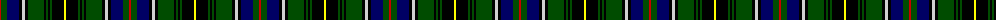

The parent of this is [MacInnes](/tartans/r/2/g6/db12/k3/n3/k3/g16/k2/g2/k2/g2/k12/y/2/)

This was sourced from weddslist.  It is a [13 stripes tartan](/stripes/stripes13/).

Original link http://www.weddslist.com/cgi-bin/tartans/pg.pl?source=rb

## Thread count
R/2 G6 DB12 K3 N3 K3 G16 K2 G2 K2 G2 K12 Y/2

## Palette
Each colour and its ΔE from the base-6 reference it is a variant of.

| Colour | Shade | Base | ΔE (OKLab) |
|---|---|---|---|
| DB |  `#000064` | B  | 0.17 |
| G |  `#004C00` | G  | 0.08 |
| K |  `#000000` | K  | 0.00 |
| N |  `#D0D0D0` | W  | 0.11 |
| R |  `#C80000` | R  | 0.00 |
| Y |  `#FFFF00` | Y  | 0.16 |

ID: /variants/r/2/g6/db12/k3/n3/k3/g16/k2/g2/k2/g2/k12/y/2-db000064-g004c00-k000000-nd0d0d0-rc80000-yffff00/
