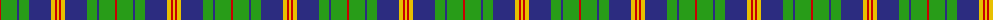
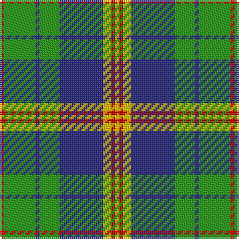

The parent of this is [New Mexico, State of](/tartans/r/2/ga16/db2/ga10/db22/y4/r2/y/2/)

This was sourced from register-of-tartans.  It is a [8 stripes tartan](/stripes/stripes8/).

Original link https://www.tartanregister.gov.uk/tartanDetails.aspx?ref=3116

## Thread count
R/2 Ga16 DB2 Ga10 DB22 Y4 R2 Y/2

## Palette
Each colour and its ΔE from the base-6 reference it is a variant of.

| Colour | Shade | Base | ΔE (OKLab) |
|---|---|---|---|
| DB |  `#2C2C80` | B  | 0.05 |
| G |  `#006818` | G  | 0.02 |
| Ga |  `#289C18` | G  | 0.18 |
| R |  `#C80000` | R  | 0.00 |
| Y |  `#E8C000` | Y  | 0.00 |

# Sample pattern

ID: /variants/r/2/ga16/db2/ga10/db22/y4/r2/y/2-db2c2c80-g006818-ga289c18-rc80000-ye8c000/
