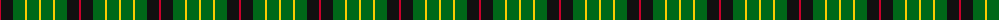
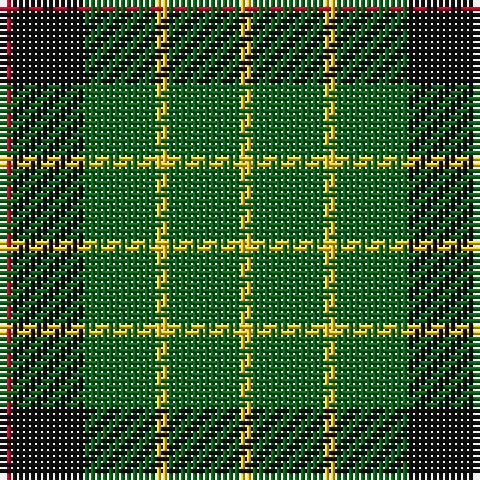

The parent of this is [Moore Caledonian (Personal)](/tartans/r/2/k12/g12/y2/g12/y/2/)

This was sourced from tartans-authority.  It is a [6 stripes tartan](/stripes/stripes6/).

Original link http://www.tartansauthority.com/tartan-ferret/display/8551/

## Thread count
R/2 K12 G12 Y2 G12 Y/2

## Palette
Each colour and its ΔE from the base-6 reference it is a variant of.

| Colour | Shade | Base | ΔE (OKLab) |
|---|---|---|---|
| G |  `#006818` | G  | 0.02 |
| K |  `#101010` | K  | 0.17 |
| R |  `#C8002C` | R  | 0.03 |
| Y |  `#FCCC00` | Y  | 0.04 |

# Sample pattern

ID: /variants/r/2/k12/g12/y2/g12/y/2-g006818-k101010-rc8002c-yfccc00/
