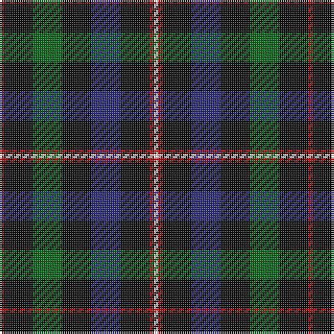

The parent of this is [Tennent (Personal)](/tartans/r/2/k14/g14/k14/db14/k14/r2/w/2/)

This was sourced from tartans-authority.  It is a [8 stripes tartan](/stripes/stripes8/).

Original link http://www.tartansauthority.com/tartan-ferret/display/6741/

## Thread count
R/2 K14 G14 K14 DB14 K14 R2 W/2

## Palette
Each colour and its ΔE from the base-6 reference it is a variant of.

| Colour | Shade | Base | ΔE (OKLab) |
|---|---|---|---|
| DB |  `#2C2C80` | B  | 0.05 |
| G |  `#006818` | G  | 0.02 |
| K |  `#101010` | K  | 0.17 |
| R |  `#C80000` | R  | 0.00 |
| W |  `#F8F8F8` | W  | 0.01 |

# Sample pattern

ID: /variants/r/2/k14/g14/k14/db14/k14/r2/w/2-db2c2c80-g006818-k101010-rc80000-wf8f8f8/
