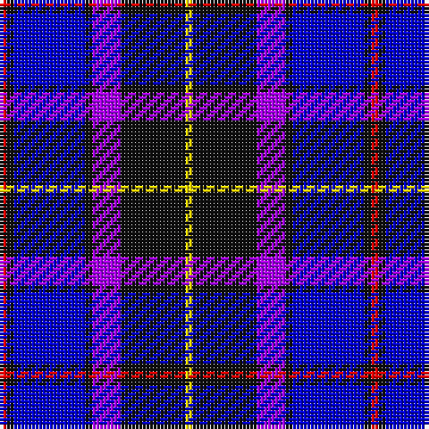

The parent of this is [Graeme High School Homecoming 2009](/tartans/r/2/k2/b20/k2/p8/k18/y/2/)

This was sourced from register-of-tartans.  It is a [7 stripes tartan](/stripes/stripes7/).

Original link https://www.tartanregister.gov.uk/tartanDetails.aspx?ref=10221

## Thread count
R/2 K2 B20 K2 P8 K18 Y/2

## Palette
Each colour and its ΔE from the base-6 reference it is a variant of.

| Colour | Shade | Base | ΔE (OKLab) |
|---|---|---|---|
| B |  `#0000CD` | B  | 0.15 |
| K |  `#101010` | K  | 0.17 |
| P |  `#AA00FF` | B  | 0.29 |
| R |  `#FF0000` | R  | 0.11 |
| Y |  `#FFE600` | Y  | 0.10 |

# Sample pattern

ID: /variants/r/2/k2/b20/k2/p8/k18/y/2-b0000cd-k101010-paa00ff-rff0000-yffe600/
