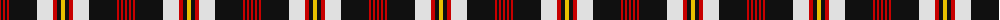

The parent of this is [Barbecue Plaid Tartan Tartan Number: 1607. Earliest known date: pre 1964 From STS member, Alex Lumsden in Toronto, Canada. See products available Copyright © Blair Urquhart, Comrie, 2015](/tartans/r/2/k2/r2/k2/r2/k28/ln16/r4/k4/y/4/)

This was sourced from house-of-tartan.  It is a [10 stripes tartan](/stripes/stripes10/).

Original link http://www.house-of-tartan.scotland.net/house/TartanViewjs.asp?colr=Def&tnam=1607

## Thread count
R/2 K2 R2 K2 R2 K28 LN16 R4 K4 Y/4

## Palette
Each colour and its ΔE from the base-6 reference it is a variant of.

| Colour | Shade | Base | ΔE (OKLab) |
|---|---|---|---|
| K |  `#101010` | K  | 0.17 |
| LN |  `#E0E0E0` | W  | 0.06 |
| R |  `#C80000` | R  | 0.00 |
| Y |  `#E8C000` | Y  | 0.00 |

ID: /variants/r/2/k2/r2/k2/r2/k28/ln16/r4/k4/y/4-k101010-lne0e0e0-rc80000-ye8c000/
