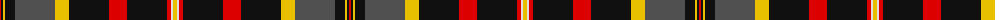

The parent of this is [Cates Dress](/tartans/r/2/k2/y2/k10/n40/y14/k40/r18/k40/r4/ln2/y/4/)

This was sourced from register-of-tartans.  It is a [12 stripes tartan](/stripes/stripes12/).

Original link https://www.tartanregister.gov.uk/tartanDetails.aspx?ref=5928

## Thread count
R/2 K2 Y2 K10 N40 Y14 K40 R18 K40 R4 LN2 Y/4

## Palette
Each colour and its ΔE from the base-6 reference it is a variant of.

| Colour | Shade | Base | ΔE (OKLab) |
|---|---|---|---|
| K |  `#101010` | K  | 0.17 |
| LN |  `#E0E0E0` | W  | 0.06 |
| N |  `#505050` | B  | 0.12 |
| R |  `#DC0000` | R  | 0.04 |
| Y |  `#E8C000` | Y  | 0.00 |

ID: /variants/r/2/k2/y2/k10/n40/y14/k40/r18/k40/r4/ln2/y/4-k101010-lne0e0e0-n505050-rdc0000-ye8c000/
