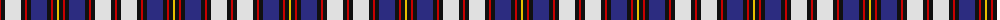

The parent of this is [Andreou Family (Personal)](/tartans/r/2/k4/ln16/k4/r2/k4/db16/k4/r2/k4/y/2/)

This was sourced from tartans-authority.  It is a [11 stripes tartan](/stripes/stripes11/).

Original link http://www.tartansauthority.com/tartan-ferret/display/7909/

## Thread count
R/2 K4 LN16 K4 R2 K4 DB16 K4 R2 K4 Y/2

## Palette
Each colour and its ΔE from the base-6 reference it is a variant of.

| Colour | Shade | Base | ΔE (OKLab) |
|---|---|---|---|
| DB |  `#2C2C80` | B  | 0.05 |
| K |  `#101010` | K  | 0.17 |
| LN |  `#E0E0E0` | W  | 0.06 |
| R |  `#C80000` | R  | 0.00 |
| Y |  `#E8C000` | Y  | 0.00 |

ID: /variants/r/2/k4/ln16/k4/r2/k4/db16/k4/r2/k4/y/2-db2c2c80-k101010-lne0e0e0-rc80000-ye8c000/
