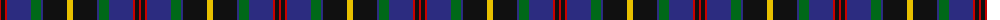
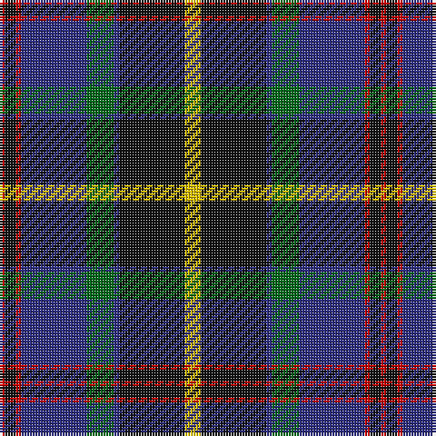

The parent of this is [Sandberg of Greenock (Personal)](/tartans/r/2/k4/r2/db24/g10/db2/k24/y/6/)

This was sourced from tartans-authority.  It is a [8 stripes tartan](/stripes/stripes8/).

Original link http://www.tartansauthority.com/tartan-ferret/display/6974/

## Thread count
R/2 K4 R2 DB24 G10 DB2 K24 Y/6

## Palette
Each colour and its ΔE from the base-6 reference it is a variant of.

| Colour | Shade | Base | ΔE (OKLab) |
|---|---|---|---|
| DB |  `#2C2C80` | B  | 0.05 |
| G |  `#006818` | G  | 0.02 |
| K |  `#101010` | K  | 0.17 |
| R |  `#C80000` | R  | 0.00 |
| Y |  `#E8C000` | Y  | 0.00 |

# Sample pattern

ID: /variants/r/2/k4/r2/db24/g10/db2/k24/y/6-db2c2c80-g006818-k101010-rc80000-ye8c000/
