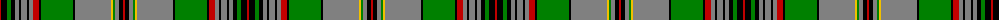

The parent of this is [Craig](/tartans/r/2/k6/g4/k4/n4/k2/n6/k2/n4/r6/k2/g32/k2/n36/y2/g2/n4/k4/r/2/)

This was sourced from weddslist.  It is a [19 stripes tartan](/stripes/stripes19/).

Original link http://www.weddslist.com/cgi-bin/tartans/pg.pl?source=sts

## Thread count
R/2 K6 G4 K4 N4 K2 N6 K2 N4 R6 K2 G32 K2 N36 Y2 G2 N4 K4 R/2

## Palette
Each colour and its ΔE from the base-6 reference it is a variant of.

| Colour | Shade | Base | ΔE (OKLab) |
|---|---|---|---|
| G |  `#008000` | G  | 0.09 |
| K |  `#000000` | K  | 0.00 |
| N |  `#808080` | G  | 0.22 |
| R |  `#C00000` | R  | 0.02 |
| Y |  `#F0C000` | Y  | 0.01 |

ID: /variants/r/2/k6/g4/k4/n4/k2/n6/k2/n4/r6/k2/g32/k2/n36/y2/g2/n4/k4/r/2-g008000-k000000-n808080-rc00000-yf0c000/
