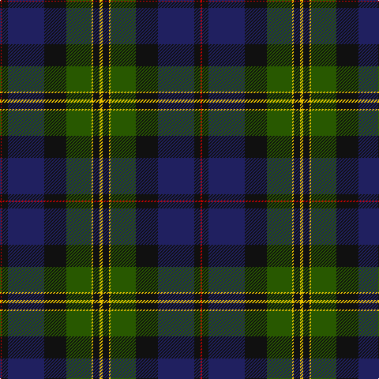

The parent of this is [Thomas of Craigie (Personal)](/tartans/r/2/k8/db46/k28/g32/y2/k8/y/4/)

This was sourced from tartans-authority.  It is a [8 stripes tartan](/stripes/stripes8/).

Original link http://www.tartansauthority.com/tartan-ferret/display/10959/

## Thread count
R/2 K8 DB46 K28 G32 Y2 K8 Y/4

## Palette
Each colour and its ΔE from the base-6 reference it is a variant of.

| Colour | Shade | Base | ΔE (OKLab) |
|---|---|---|---|
| DB |  `#202060` | B  | 0.11 |
| G |  `#285800` | G  | 0.04 |
| K |  `#101010` | K  | 0.17 |
| R |  `#C80000` | R  | 0.00 |
| Y |  `#E8C000` | Y  | 0.00 |

# Sample pattern

ID: /variants/r/2/k8/db46/k28/g32/y2/k8/y/4-db202060-g285800-k101010-rc80000-ye8c000/
