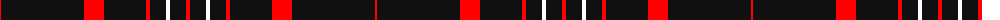

The parent of this is [Brand Ambassador](/tartans/r/2/k83/r20/k42/r4/k16/w4/k16/r/4/)

This was sourced from register-of-tartans.  It is a [9 stripes tartan](/stripes/stripes9/).

Original link https://www.tartanregister.gov.uk/tartanDetails.aspx?ref=10462

## Thread count
R/2 K83 R20 K42 R4 K16 W4 K16 R/4

## Palette
Each colour and its ΔE from the base-6 reference it is a variant of.

| Colour | Shade | Base | ΔE (OKLab) |
|---|---|---|---|
| K |  `#101010` | K  | 0.17 |
| R |  `#FF0000` | R  | 0.11 |
| W |  `#FFFFFF` | W  | 0.03 |

ID: /variants/r/2/k83/r20/k42/r4/k16/w4/k16/r/4-k101010-rff0000-wffffff/
