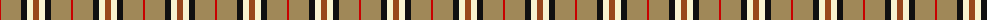
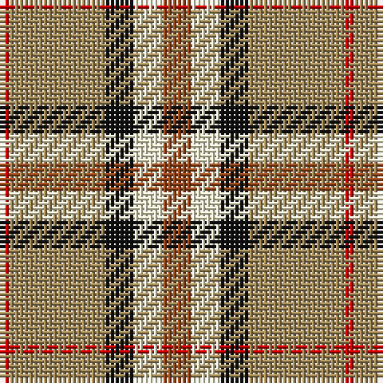

The parent of this is [Burberry Counterfeit](/tartans/r/2/lt20/k6/lya6/t/6/)

This was sourced from register-of-tartans.  It is a [5 stripes tartan](/stripes/stripes5/).

Original link https://www.tartanregister.gov.uk/tartanDetails.aspx?ref=441

## Thread count
R/2 LT20 K6 LYa6 T/6

## Palette
Each colour and its ΔE from the base-6 reference it is a variant of.

| Colour | Shade | Base | ΔE (OKLab) |
|---|---|---|---|
| DO |  `#B84C00` | R  | 0.08 |
| DR |  `#880000` | R  | 0.14 |
| K |  `#101010` | K  | 0.17 |
| LT |  `#A08858` | Y  | 0.21 |
| LY |  `#F8F4D0` | W  | 0.04 |
| LYa |  `#F8F4D0` | W  | 0.04 |
| N |  `#C0C0C0` | W  | 0.16 |
| R |  `#C80000` | R  | 0.00 |
| T |  `#98481C` | R  | 0.11 |

# Sample pattern

ID: /variants/r/2/lt20/k6/lya6/t/6-dob84c00-dr880000-k101010-lta08858-lyf8f4d0-lyaf8f4d0-nc0c0c0-rc80000-t98481c/
