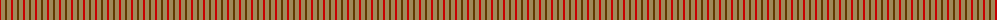
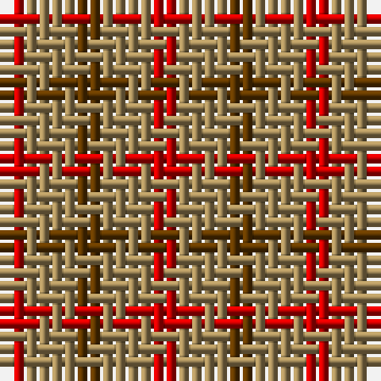

The parent of this is [Glenmorangie Check (Corporate)](/tartans/r/2/lt4/t/2/)

This was sourced from tartans-authority.  It is a [3 stripes tartan](/stripes/stripes3/).

Original link http://www.tartansauthority.com/tartan-ferret/display/5040/

## Thread count
R/2 LT4 T/2

## Palette
Each colour and its ΔE from the base-6 reference it is a variant of.

| Colour | Shade | Base | ΔE (OKLab) |
|---|---|---|---|
| LT |  `#A08858` | Y  | 0.21 |
| R |  `#C80000` | R  | 0.00 |
| T |  `#603800` | G  | 0.16 |

# Sample pattern

ID: /variants/r/2/lt4/t/2-lta08858-rc80000-t603800/
