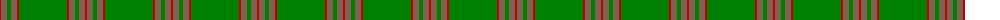

The parent of this is [Unnamed Green (Teddy Bear)](/tartans/r/2/lt6/g4/lt6/r2/g48/r2/lt6/g4/lt6/r/2/)

This was sourced from weddslist.  It is a [11 stripes tartan](/stripes/stripes11/).

Original link http://www.weddslist.com/cgi-bin/tartans/pg.pl?source=sts

## Thread count
R/2 LT6 G4 LT6 R2 G48 R2 LT6 G4 LT6 R/2

## Palette
Each colour and its ΔE from the base-6 reference it is a variant of.

| Colour | Shade | Base | ΔE (OKLab) |
|---|---|---|---|
| G |  `#008000` | G  | 0.09 |
| LT |  `#806050` | R  | 0.17 |
| R |  `#C00000` | R  | 0.02 |

ID: /variants/r/2/lt6/g4/lt6/r2/g48/r2/lt6/g4/lt6/r/2-g008000-lt806050-rc00000/
