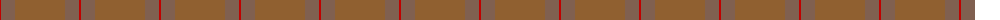

The parent of this is [Unnamed Brown (Teddy Bear)](/tartans/r/2/lta14/lt50/lta14/r/2/)

This was sourced from weddslist.  It is a [5 stripes tartan](/stripes/stripes5/).

Original link http://www.weddslist.com/cgi-bin/tartans/pg.pl?source=sts

## Thread count
R/2 LTa14 LT50 LTa14 R/2

## Palette
Each colour and its ΔE from the base-6 reference it is a variant of.

| Colour | Shade | Base | ΔE (OKLab) |
|---|---|---|---|
| LT |  `#906030` | R  | 0.15 |
| LTa |  `#806050` | R  | 0.17 |
| R |  `#C00000` | R  | 0.02 |

# Sample pattern

ID: /variants/r/2/lta14/lt50/lta14/r/2-lt906030-lta806050-rc00000/
