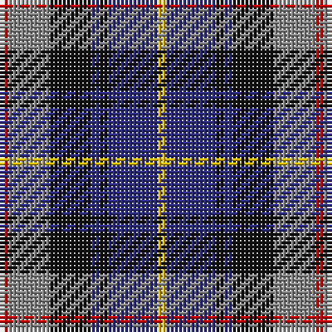

The parent of this is [Lopez-Gasparotto (Personal)](/tartans/r/2/n10/k10/db2/k2/db12/y/2/)

This was sourced from tartans-authority.  It is a [7 stripes tartan](/stripes/stripes7/).

Original link http://www.tartansauthority.com/tartan-ferret/display/6714/

## Thread count
R/2 N10 K10 DB2 K2 DB12 Y/2

## Palette
Each colour and its ΔE from the base-6 reference it is a variant of.

| Colour | Shade | Base | ΔE (OKLab) |
|---|---|---|---|
| DB |  `#2C2C80` | B  | 0.05 |
| K |  `#101010` | K  | 0.17 |
| N |  `#888888` | R  | 0.24 |
| R |  `#C80000` | R  | 0.00 |
| Y |  `#E8C000` | Y  | 0.00 |

# Sample pattern

ID: /variants/r/2/n10/k10/db2/k2/db12/y/2-db2c2c80-k101010-n888888-rc80000-ye8c000/
