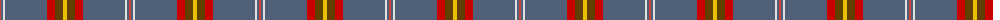
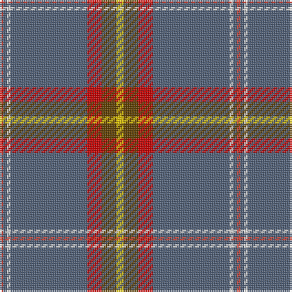

The parent of this is [Edinburgh Fire (Corporate)](/tartans/r/2/n2/ln2/n42/ra8/t8/y/4/)

This was sourced from tartans-authority.  It is a [7 stripes tartan](/stripes/stripes7/).

Original link http://www.tartansauthority.com/tartan-ferret/display/7666/

## Thread count
R/2 N2 LN2 N42 Ra8 T8 Y/4

## Palette
Each colour and its ΔE from the base-6 reference it is a variant of.

| Colour | Shade | Base | ΔE (OKLab) |
|---|---|---|---|
| LN |  `#E0E0E0` | W  | 0.06 |
| N |  `#506078` | B  | 0.12 |
| R |  `#CC4438` | R  | 0.07 |
| Ra |  `#C80000` | R  | 0.00 |
| T |  `#604000` | G  | 0.14 |
| Y |  `#E8C000` | Y  | 0.00 |

# Sample pattern

ID: /variants/r/2/n2/ln2/n42/ra8/t8/y/4-lne0e0e0-n506078-rcc4438-rac80000-t604000-ye8c000/
