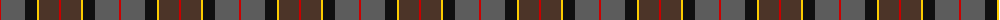
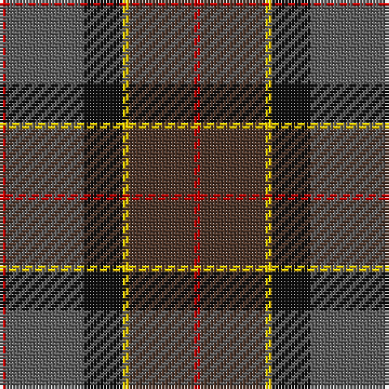

The parent of this is [Andover (Fashion)](/tartans/r/2/n24/k12/y2/t20/r/2/)

This was sourced from tartans-authority.  It is a [6 stripes tartan](/stripes/stripes6/).

Original link http://www.tartansauthority.com/tartan-ferret/display/3019/

## Thread count
R/2 N24 K12 Y2 T20 R/2

## Palette
Each colour and its ΔE from the base-6 reference it is a variant of.

| Colour | Shade | Base | ΔE (OKLab) |
|---|---|---|---|
| K |  `#101010` | K  | 0.17 |
| N |  `#5C5C5C` | B  | 0.14 |
| R |  `#C80000` | R  | 0.00 |
| T |  `#4C3428` | B  | 0.16 |
| Y |  `#FCCC00` | Y  | 0.04 |

# Sample pattern

ID: /variants/r/2/n24/k12/y2/t20/r/2-k101010-n5c5c5c-rc80000-t4c3428-yfccc00/
