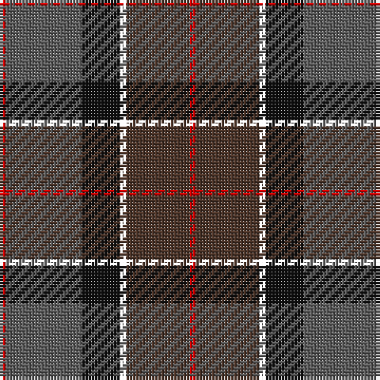

The parent of this is [Andover](/tartans/r/2/n24/k12/yy2/t20/r/2/)

This was sourced from register-of-tartans.  It is a [6 stripes tartan](/stripes/stripes6/).

Original link https://www.tartanregister.gov.uk/tartanDetails.aspx?ref=5256

## Thread count
R/2 N24 K12 YY2 T20 R/2

## Palette
Each colour and its ΔE from the base-6 reference it is a variant of.

| Colour | Shade | Base | ΔE (OKLab) |
|---|---|---|---|
| DR |  `#880000` | R  | 0.14 |
| DY |  `#BC8C00` | Y  | 0.16 |
| K |  `#101010` | K  | 0.17 |
| N |  `#5C5C5C` | B  | 0.14 |
| R |  `#C80000` | R  | 0.00 |
| T |  `#4C3428` | B  | 0.16 |

# Sample pattern

ID: /variants/r/2/n24/k12/yy2/t20/r/2-dr880000-dybc8c00-k101010-n5c5c5c-rc80000-t4c3428/
