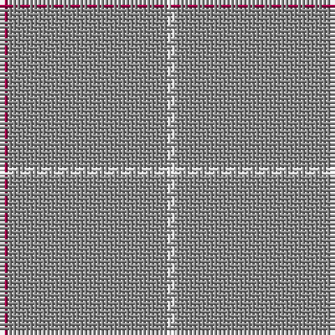

The parent of this is [Dunbar of Pitgaveny (Clan)](/tartans/r/2/n38/w/2/)

This was sourced from tartans-authority.  It is a [3 stripes tartan](/stripes/stripes3/).

Original link http://www.tartansauthority.com/tartan-ferret/display/1634/

## Thread count
R/2 N38 W/2

## Palette
Each colour and its ΔE from the base-6 reference it is a variant of.

| Colour | Shade | Base | ΔE (OKLab) |
|---|---|---|---|
| N |  `#888888` | R  | 0.24 |
| R |  `#A00048` | R  | 0.11 |
| W |  `#FCFCFC` | W  | 0.03 |

# Sample pattern

ID: /variants/r/2/n38/w/2-n888888-ra00048-wfcfcfc/
