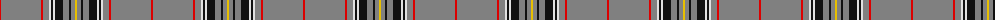

The parent of this is [Stuart/Stewart Authentic Grey](/tartans/r/2/n40/r2/n6/ln2/k2/ln2/k8/n6/k2/n4/y/2/)

This was sourced from register-of-tartans.  It is a [12 stripes tartan](/stripes/stripes12/).

Original link https://www.tartanregister.gov.uk/tartanDetails.aspx?ref=3994

## Thread count
R/2 N40 R2 N6 LN2 K2 LN2 K8 N6 K2 N4 Y/2

## Palette
Each colour and its ΔE from the base-6 reference it is a variant of.

| Colour | Shade | Base | ΔE (OKLab) |
|---|---|---|---|
| K |  `#101010` | K  | 0.17 |
| LN |  `#E0E0E0` | W  | 0.06 |
| N |  `#808080` | G  | 0.22 |
| R |  `#DC0000` | R  | 0.04 |
| Y |  `#E8C000` | Y  | 0.00 |

ID: /variants/r/2/n40/r2/n6/ln2/k2/ln2/k8/n6/k2/n4/y/2-k101010-lne0e0e0-n808080-rdc0000-ye8c000/
