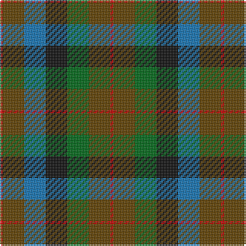

The parent of this is [Tennant (Clan)](/tartans/r/2/t14/b14/k14/g14/t14/r/2/)

This was sourced from tartans-authority.  It is a [7 stripes tartan](/stripes/stripes7/).

Original link http://www.tartansauthority.com/tartan-ferret/display/1653/

## Thread count
R/2 T14 B14 K14 G14 T14 R/2

## Palette
Each colour and its ΔE from the base-6 reference it is a variant of.

| Colour | Shade | Base | ΔE (OKLab) |
|---|---|---|---|
| B |  `#1474B4` | B  | 0.15 |
| G |  `#006818` | G  | 0.02 |
| K |  `#101010` | K  | 0.17 |
| R |  `#C80000` | R  | 0.00 |
| T |  `#604000` | G  | 0.14 |

# Sample pattern

ID: /variants/r/2/t14/b14/k14/g14/t14/r/2-b1474b4-g006818-k101010-rc80000-t604000/
