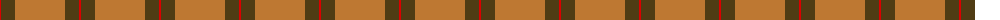

The parent of this is [Unnamed Brown (Teddy Bear)](/tartans/r/2/t14/do50/t14/r/2/)

This was sourced from register-of-tartans.  It is a [5 stripes tartan](/stripes/stripes5/).

Original link https://www.tartanregister.gov.uk/tartanDetails.aspx?ref=4411

## Thread count
R/2 T14 DO50 T14 R/2

## Palette
Each colour and its ΔE from the base-6 reference it is a variant of.

| Colour | Shade | Base | ΔE (OKLab) |
|---|---|---|---|
| DO |  `#BE7832` | R  | 0.17 |
| R |  `#DC0000` | R  | 0.04 |
| T |  `#503C14` | G  | 0.15 |

# Sample pattern

ID: /variants/r/2/t14/do50/t14/r/2-dobe7832-rdc0000-t503c14/
