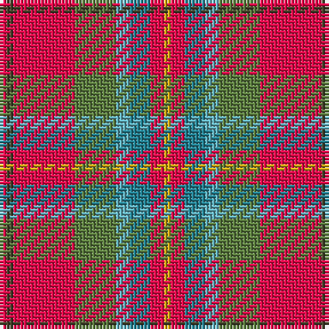

The parent of this is [Battle of Bannockburn, The](/tartans/r/2/t2/r18/g12/b4/ba6/r4/y/2/)

This was sourced from register-of-tartans.  It is a [8 stripes tartan](/stripes/stripes8/).

Original link https://www.tartanregister.gov.uk/tartanDetails.aspx?ref=10788

## Thread count
R/2 T2 R18 G12 B4 Ba6 R4 Y/2

## Palette
Each colour and its ΔE from the base-6 reference it is a variant of.

| Colour | Shade | Base | ΔE (OKLab) |
|---|---|---|---|
| B |  `#62B0BE` | Y  | 0.24 |
| Ba |  `#248192` | G  | 0.19 |
| G |  `#5D7F40` | G  | 0.13 |
| R |  `#F00C4C` | R  | 0.10 |
| T |  `#413F28` | G  | 0.14 |
| Y |  `#D3A916` | Y  | 0.07 |

# Sample pattern

ID: /variants/r/2/t2/r18/g12/b4/ba6/r4/y/2-b62b0be-ba248192-g5d7f40-rf00c4c-t413f28-yd3a916/
