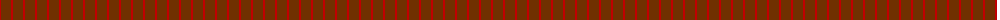
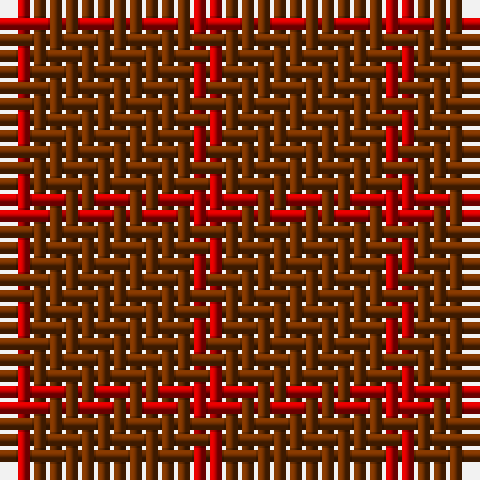

The parent of this is [Glenmorangie, Check](/tartans/r/2/t4/ta/2/)

This was sourced from weddslist.  It is a [3 stripes tartan](/stripes/stripes3/).

Original link http://www.weddslist.com/cgi-bin/tartans/pg.pl?source=sts

## Thread count
R/2 T4 Ta/2

## Palette
Each colour and its ΔE from the base-6 reference it is a variant of.

| Colour | Shade | Base | ΔE (OKLab) |
|---|---|---|---|
| R |  `#C00000` | R  | 0.02 |
| T |  `#703000` | R  | 0.18 |
| Ta |  `#703000` | R  | 0.18 |

# Sample pattern

ID: /variants/r/2/t4/ta/2-rc00000-t703000-ta703000/
