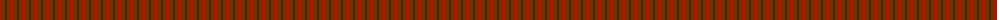
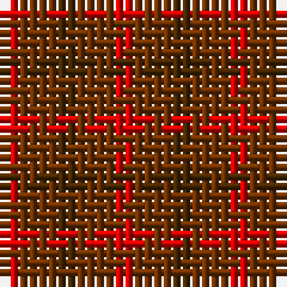

The parent of this is [Glenmorangie Check](/tartans/r/2/ta4/t/2/)

This was sourced from register-of-tartans.  It is a [3 stripes tartan](/stripes/stripes3/).

Original link https://www.tartanregister.gov.uk/tartanDetails.aspx?ref=1426

## Thread count
R/2 Ta4 T/2

## Palette
Each colour and its ΔE from the base-6 reference it is a variant of.

| Colour | Shade | Base | ΔE (OKLab) |
|---|---|---|---|
| R |  `#DC0000` | R  | 0.04 |
| T |  `#482800` | G  | 0.19 |
| Ta |  `#703200` | R  | 0.18 |

# Sample pattern

ID: /variants/r/2/ta4/t/2-rdc0000-t482800-ta703200/
