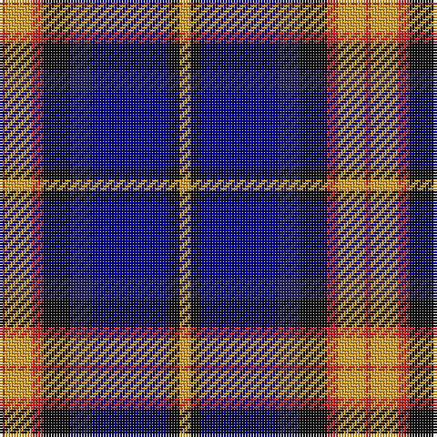

The parent of this is [Lovell (2014)](/tartans/r/2/y10/r4/k10/dba8/db28/k4/y/4/)

This was sourced from register-of-tartans.  It is a [8 stripes tartan](/stripes/stripes8/).

Original link https://www.tartanregister.gov.uk/tartanDetails.aspx?ref=11036

## Thread count
R/2 Y10 R4 K10 DBa8 DB28 K4 Y/4

## Palette
Each colour and its ΔE from the base-6 reference it is a variant of.

| Colour | Shade | Base | ΔE (OKLab) |
|---|---|---|---|
| DB |  `#00008C` | B  | 0.13 |
| DBa |  `#202060` | B  | 0.11 |
| K |  `#101010` | K  | 0.17 |
| R |  `#C82828` | R  | 0.03 |
| Y |  `#E0A126` | Y  | 0.08 |

# Sample pattern

ID: /variants/r/2/y10/r4/k10/dba8/db28/k4/y/4-db00008c-dba202060-k101010-rc82828-ye0a126/
