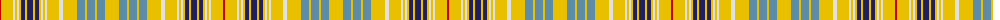

The parent of this is [Ottawa District Tartan Tartan Number: 2021. Earliest known date: 1966 In two blocks - Navy Block ends on 14th colour change Gold 24. Azure Block starts on the following White 8. The design was accepted as the Official Tartan of Ottawa by order of the Council on November 21st 1966. In 1985 it was no longer in commercial production. See products available Copyright © Blair Urquhart, Comrie, 2015](/tartans/r/2/y12/ln2/y2/ln2/y2/db4/y2/db6/y2/db4/y2/ln2/y2/ln2/y12/ln4/y14/b8/y2/b8/y2/b8/y/14/)

This was sourced from house-of-tartan.  It is a [24 stripes tartan](/stripes/stripes24/).

Original link http://www.house-of-tartan.scotland.net/house/TartanViewjs.asp?colr=Def&tnam=2021

## Thread count
R/2 Y12 LN2 Y2 LN2 Y2 DB4 Y2 DB6 Y2 DB4 Y2 LN2 Y2 LN2 Y12 LN4 Y14 B8 Y2 B8 Y2 B8 Y/14

## Palette
Each colour and its ΔE from the base-6 reference it is a variant of.

| Colour | Shade | Base | ΔE (OKLab) |
|---|---|---|---|
| B |  `#5C8CA8` | B  | 0.23 |
| DB |  `#202060` | B  | 0.11 |
| LN |  `#E0E0E0` | W  | 0.06 |
| R |  `#C80000` | R  | 0.00 |
| Y |  `#E8C000` | Y  | 0.00 |

ID: /variants/r/2/y12/ln2/y2/ln2/y2/db4/y2/db6/y2/db4/y2/ln2/y2/ln2/y12/ln4/y14/b8/y2/b8/y2/b8/y/14-b5c8ca8-db202060-lne0e0e0-rc80000-ye8c000/
