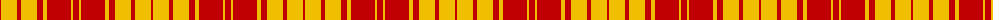

The parent of this is [MacMillan](/tartans/r/2/y16/r4/y16/r6/y4/r24/y2/r/6/)

This was sourced from weddslist.  It is a [9 stripes tartan](/stripes/stripes9/).

Original link http://www.weddslist.com/cgi-bin/tartans/pg.pl?source=sts

## Thread count
R/2 Y16 R4 Y16 R6 Y4 R24 Y2 R/6

## Palette
Each colour and its ΔE from the base-6 reference it is a variant of.

| Colour | Shade | Base | ΔE (OKLab) |
|---|---|---|---|
| R |  `#C00000` | R  | 0.02 |
| Y |  `#F0C000` | Y  | 0.01 |

ID: /variants/r/2/y16/r4/y16/r6/y4/r24/y2/r/6-rc00000-yf0c000/
