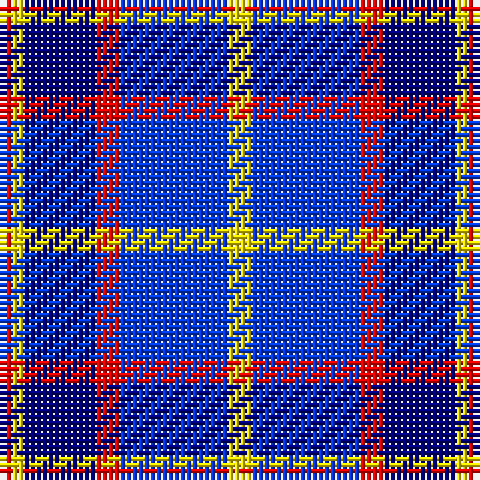

The parent of this is [Lauder Primary School](/tartans/r/2/y2/db12/r4/b18/y/4/)

This was sourced from register-of-tartans.  It is a [6 stripes tartan](/stripes/stripes6/).

Original link https://www.tartanregister.gov.uk/tartanDetails.aspx?ref=10307

## Thread count
R/2 Y2 DB12 R4 B18 Y/4

## Palette
Each colour and its ΔE from the base-6 reference it is a variant of.

| Colour | Shade | Base | ΔE (OKLab) |
|---|---|---|---|
| B |  `#003BEB` | B  | 0.17 |
| DB |  `#000080` | B  | 0.14 |
| R |  `#FF0000` | R  | 0.11 |
| Y |  `#FFE600` | Y  | 0.10 |

# Sample pattern

ID: /variants/r/2/y2/db12/r4/b18/y/4-b003beb-db000080-rff0000-yffe600/
