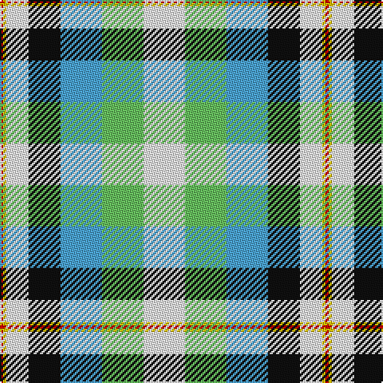

The parent of this is [Lachine (Historic) (District)](/tartans/r/2/y2/w14/k20/b26/lg26/w/26/)

This was sourced from tartans-authority.  It is a [7 stripes tartan](/stripes/stripes7/).

Original link http://www.tartansauthority.com/tartan-ferret/display/6203/

## Thread count
R/2 Y2 W14 K20 B26 LG26 W/26

## Palette
Each colour and its ΔE from the base-6 reference it is a variant of.

| Colour | Shade | Base | ΔE (OKLab) |
|---|---|---|---|
| B |  `#4CA4D8` | B  | 0.30 |
| K |  `#101010` | K  | 0.17 |
| LG |  `#68C060` | Y  | 0.16 |
| R |  `#C80000` | R  | 0.00 |
| W |  `#FCFCFC` | W  | 0.03 |
| Y |  `#E8C000` | Y  | 0.00 |

# Sample pattern

ID: /variants/r/2/y2/w14/k20/b26/lg26/w/26-b4ca4d8-k101010-lg68c060-rc80000-wfcfcfc-ye8c000/
