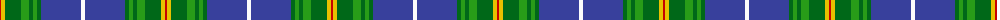

The parent of this is [Nova Scotia (District)](/tartans/r/2/y4/ga16/g8/ga4/g4/ga4/b40/w/4/)

This was sourced from tartans-authority.  It is a [9 stripes tartan](/stripes/stripes9/).

Original link http://www.tartansauthority.com/tartan-ferret/display/1713/

## Thread count
R/2 Y4 Ga16 G8 Ga4 G4 Ga4 B40 W/4

## Palette
Each colour and its ΔE from the base-6 reference it is a variant of.

| Colour | Shade | Base | ΔE (OKLab) |
|---|---|---|---|
| B |  `#38409C` | B  | 0.04 |
| G |  `#289C18` | G  | 0.18 |
| Ga |  `#006818` | G  | 0.02 |
| R |  `#C80000` | R  | 0.00 |
| W |  `#FCFCFC` | W  | 0.03 |
| Y |  `#E8C000` | Y  | 0.00 |

ID: /variants/r/2/y4/ga16/g8/ga4/g4/ga4/b40/w/4-b38409c-g289c18-ga006818-rc80000-wfcfcfc-ye8c000/
