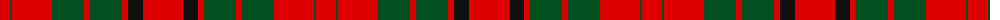

The parent of this is [Maxwell Variant](/tartans/r/20/g2/r40/g32/r6/g32/r6/k15/r/40/)

This was sourced from register-of-tartans.  It is a [9 stripes tartan](/stripes/stripes9/).

Original link https://www.tartanregister.gov.uk/tartanDetails.aspx?ref=2864

## Thread count
R/20 G2 R40 G32 R6 G32 R6 K15 R/40

## Palette
Each colour and its ΔE from the base-6 reference it is a variant of.

| Colour | Shade | Base | ΔE (OKLab) |
|---|---|---|---|
| G |  `#005020` | G  | 0.08 |
| K |  `#101010` | K  | 0.17 |
| R |  `#DC0000` | R  | 0.04 |

ID: /variants/r/20/g2/r40/g32/r6/g32/r6/k15/r/40-g005020-k101010-rdc0000/
