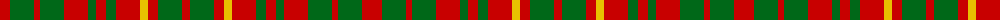

The parent of this is [MacRurie MacRory Tartan Tartan Number: 1498. Earliest known date: pre 2003 This sample comes from the MacGregor-Hastie collection which forms the basis of the cloth archive of the Scottish Tartans Society. Some of the samples, including this one, were unmarked. One can assume that the sample dates between 1930 and 1950. See products available Copyright © Blair Urquhart, Comrie, 2015](/tartans/r/20/g24/r6/g24/r24/g8/r10/g10/r24/y8/r10/g24/r/8/)

This was sourced from house-of-tartan.  It is a [13 stripes tartan](/stripes/stripes13/).

Original link http://www.house-of-tartan.scotland.net/house/TartanViewjs.asp?colr=Def&tnam=1498

## Thread count
R/20 G24 R6 G24 R24 G8 R10 G10 R24 Y8 R10 G24 R/8

## Palette
Each colour and its ΔE from the base-6 reference it is a variant of.

| Colour | Shade | Base | ΔE (OKLab) |
|---|---|---|---|
| G |  `#006818` | G  | 0.02 |
| R |  `#C80000` | R  | 0.00 |
| Y |  `#E8C000` | Y  | 0.00 |

ID: /variants/r/20/g24/r6/g24/r24/g8/r10/g10/r24/y8/r10/g24/r/8-g006818-rc80000-ye8c000/
