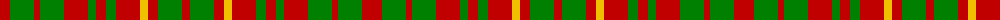

The parent of this is [MacRurie, MacRory](/tartans/r/20/g24/r6/g24/r24/g8/r10/g10/r24/y8/r10/g24/r/8/)

This was sourced from weddslist.  It is a [13 stripes tartan](/stripes/stripes13/).

Original link http://www.weddslist.com/cgi-bin/tartans/pg.pl?source=sts

## Thread count
R/20 G24 R6 G24 R24 G8 R10 G10 R24 Y8 R10 G24 R/8

## Palette
Each colour and its ΔE from the base-6 reference it is a variant of.

| Colour | Shade | Base | ΔE (OKLab) |
|---|---|---|---|
| G |  `#008000` | G  | 0.09 |
| R |  `#C00000` | R  | 0.02 |
| Y |  `#F0C000` | Y  | 0.01 |

ID: /variants/r/20/g24/r6/g24/r24/g8/r10/g10/r24/y8/r10/g24/r/8-g008000-rc00000-yf0c000/
