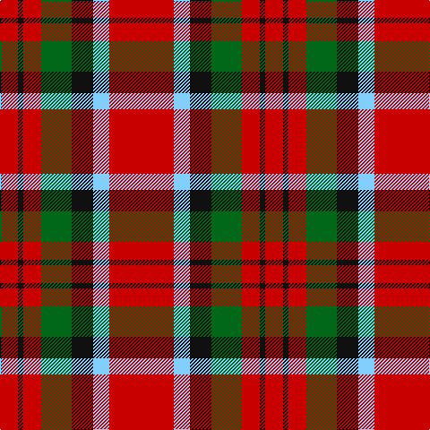

The parent of this is [MacDuff #6](/tartans/r/20/k6/r20/g34/k24/lb18/r/72/)

This was sourced from register-of-tartans.  It is a [7 stripes tartan](/stripes/stripes7/).

Original link https://www.tartanregister.gov.uk/tartanDetails.aspx?ref=2418

## Thread count
R/20 K6 R20 G34 K24 LB18 R/72

## Palette
Each colour and its ΔE from the base-6 reference it is a variant of.

| Colour | Shade | Base | ΔE (OKLab) |
|---|---|---|---|
| G |  `#006818` | G  | 0.02 |
| K |  `#101010` | K  | 0.17 |
| LB |  `#82CFFD` | W  | 0.18 |
| R |  `#C80000` | R  | 0.00 |

# Sample pattern

ID: /variants/r/20/k6/r20/g34/k24/lb18/r/72-g006818-k101010-lb82cffd-rc80000/
