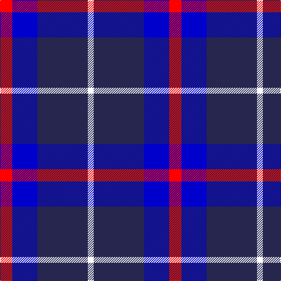

The parent of this is [Fong Wedding (Personal)](/tartans/r/21/b43/db86/w/10/)

This was sourced from register-of-tartans.  It is a [4 stripes tartan](/stripes/stripes4/).

Original link https://www.tartanregister.gov.uk/tartanDetails.aspx?ref=10828

## Thread count
R/21 B43 DB86 W/10

## Palette
Each colour and its ΔE from the base-6 reference it is a variant of.

| Colour | Shade | Base | ΔE (OKLab) |
|---|---|---|---|
| B |  `#0000CD` | B  | 0.15 |
| DB |  `#26264F` | B  | 0.11 |
| R |  `#FF0000` | R  | 0.11 |
| W |  `#FFFFFF` | W  | 0.03 |

# Sample pattern

ID: /variants/r/21/b43/db86/w/10-b0000cd-db26264f-rff0000-wffffff/
