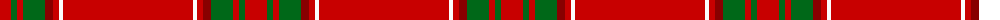

The parent of this is [Gudbrandsdalen, Rondastakken (Dist)](/tartans/r/22/g6/r6/g22/dr8/r6/w4/r/130/)

This was sourced from tartans-authority.  It is a [8 stripes tartan](/stripes/stripes8/).

Original link http://www.tartansauthority.com/tartan-ferret/display/2086/

## Thread count
R/22 G6 R6 G22 DR8 R6 W4 R/130

## Palette
Each colour and its ΔE from the base-6 reference it is a variant of.

| Colour | Shade | Base | ΔE (OKLab) |
|---|---|---|---|
| DR |  `#880000` | R  | 0.14 |
| G |  `#006818` | G  | 0.02 |
| R |  `#C80000` | R  | 0.00 |
| W |  `#FCFCFC` | W  | 0.03 |

# Sample pattern

ID: /variants/r/22/g6/r6/g22/dr8/r6/w4/r/130-dr880000-g006818-rc80000-wfcfcfc/
