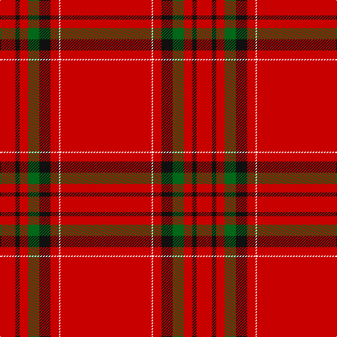

The parent of this is [Gudbrandsdalen, Rondastakken #2](/tartans/r/22/k6/r12/g16/k16/r12/w2/r/130/)

This was sourced from register-of-tartans.  It is a [8 stripes tartan](/stripes/stripes8/).

Original link https://www.tartanregister.gov.uk/tartanDetails.aspx?ref=1557

## Thread count
R/22 K6 R12 G16 K16 R12 W2 R/130

## Palette
Each colour and its ΔE from the base-6 reference it is a variant of.

| Colour | Shade | Base | ΔE (OKLab) |
|---|---|---|---|
| DG |  `#003820` | G  | 0.16 |
| DR |  `#880000` | R  | 0.14 |
| G |  `#006818` | G  | 0.02 |
| K |  `#101010` | K  | 0.17 |
| R |  `#C80000` | R  | 0.00 |
| W |  `#FCFCFC` | W  | 0.03 |

# Sample pattern

ID: /variants/r/22/k6/r12/g16/k16/r12/w2/r/130-dg003820-dr880000-g006818-k101010-rc80000-wfcfcfc/
