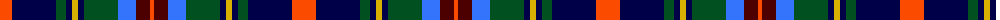

The parent of this is [Royal Dornoch Golf Club, The](/tartans/r/24/db44/g10/db6/y6/db6/g34/b18/dr14/r/4/)

This was sourced from register-of-tartans.  It is a [10 stripes tartan](/stripes/stripes10/).

Original link https://www.tartanregister.gov.uk/tartanDetails.aspx?ref=10968

## Thread count
R/24 DB44 G10 DB6 Y6 DB6 G34 B18 DR14 R/4

## Palette
Each colour and its ΔE from the base-6 reference it is a variant of.

| Colour | Shade | Base | ΔE (OKLab) |
|---|---|---|---|
| B |  `#3474FC` | B  | 0.23 |
| DB |  `#000048` | B  | 0.21 |
| DR |  `#4C0000` | B  | 0.24 |
| G |  `#005020` | G  | 0.08 |
| R |  `#FA4B00` | R  | 0.14 |
| Y |  `#D8B000` | Y  | 0.05 |

ID: /variants/r/24/db44/g10/db6/y6/db6/g34/b18/dr14/r/4-b3474fc-db000048-dr4c0000-g005020-rfa4b00-yd8b000/
