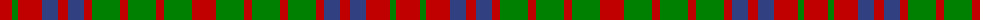

The parent of this is [Grant of Monymusk](/tartans/r/24/g6/r24/b16/r10/b16/r8/g28/r8/g28/r8/g28/r/24/)

This was sourced from weddslist.  It is a [13 stripes tartan](/stripes/stripes13/).

Original link http://www.weddslist.com/cgi-bin/tartans/pg.pl?source=sts

## Thread count
R/24 G6 R24 B16 R10 B16 R8 G28 R8 G28 R8 G28 R/24

## Palette
Each colour and its ΔE from the base-6 reference it is a variant of.

| Colour | Shade | Base | ΔE (OKLab) |
|---|---|---|---|
| B |  `#304080` | B  | 0.01 |
| G |  `#008000` | G  | 0.09 |
| R |  `#C00000` | R  | 0.02 |

ID: /variants/r/24/g6/r24/b16/r10/b16/r8/g28/r8/g28/r8/g28/r/24-b304080-g008000-rc00000/
