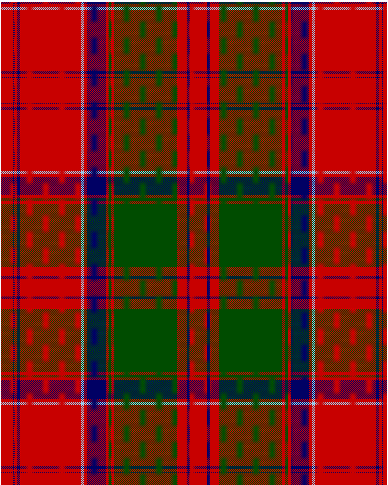

The parent of this is [Drummond of Megginch 1820 Plaid](/tartans/r/26/db2/r6/db6/r126/lb6/r6/db38/r6/g6/r6/g130/r19/db6/r/18/)

This was sourced from <no value>.  It is a [15 stripes tartan](/stripes/stripes15/).

Original link https://tartandictionary.org/posts/drummondsofmeggincholdplaid/

## Thread count
R/26 DB2 R6 DB6 R126 LB6 R6 DB38 R6 G6 R6 G130 R19 DB6 R/18

## Palette
DB G LB R

# Sample pattern

ID: /variants/r/26/db2/r6/db6/r126/lb6/r6/db38/r6/g6/r6/g130/r19/db6/r/18-db000064-g004c00-lb98c8e8-rc80000/