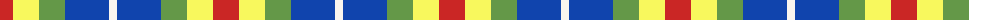
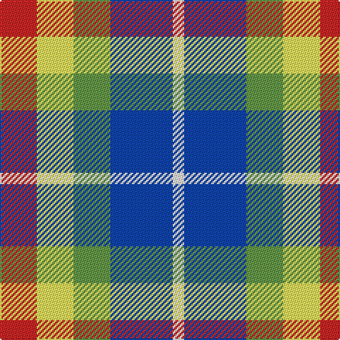

The parent of this is [Clan Haggis World (Corporate)](/tartans/r/26/ly26/lg26/b44/w/8/)

This was sourced from register-of-tartans.  It is a [5 stripes tartan](/stripes/stripes5/).

Original link https://www.tartanregister.gov.uk/tartanDetails.aspx?ref=10781

## Thread count
R/26 LY26 LG26 B44 W/8

## Palette
Each colour and its ΔE from the base-6 reference it is a variant of.

| Colour | Shade | Base | ΔE (OKLab) |
|---|---|---|---|
| B |  `#1044AD` | B  | 0.07 |
| LG |  `#649848` | G  | 0.19 |
| LY |  `#F8F85D` | Y  | 0.14 |
| R |  `#CA2625` | R  | 0.03 |
| W |  `#F9F5EF` | W  | 0.01 |

# Sample pattern

ID: /variants/r/26/ly26/lg26/b44/w/8-b1044ad-lg649848-lyf8f85d-rca2625-wf9f5ef/
