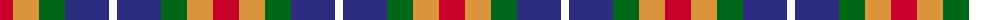

The parent of this is [Clan Haggis World (Corporate)](/tartans/r/26/o26/g26/db44/w/8/)

This was sourced from tartans-authority.  It is a [5 stripes tartan](/stripes/stripes5/).

Original link http://www.tartansauthority.com/tartan-ferret/display/10781/

## Thread count
R/26 O26 G26 DB44 W/8

## Palette
Each colour and its ΔE from the base-6 reference it is a variant of.

| Colour | Shade | Base | ΔE (OKLab) |
|---|---|---|---|
| DB |  `#2C2C80` | B  | 0.05 |
| G |  `#006818` | G  | 0.02 |
| O |  `#DC943C` | Y  | 0.12 |
| R |  `#C8002C` | R  | 0.03 |
| W |  `#FCFCFC` | W  | 0.03 |

# Sample pattern

ID: /variants/r/26/o26/g26/db44/w/8-db2c2c80-g006818-odc943c-rc8002c-wfcfcfc/
