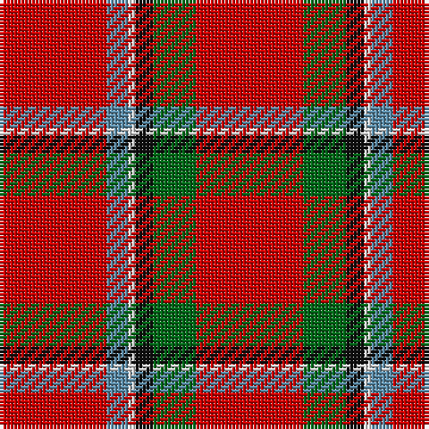

The parent of this is [Sinclair Clan Tartan Tartan Number: 1437. Earliest known date: 1815 Lyon Court record multiplied by four. A minor variation on the Cockburn specimen (1810-15) which also appears in a painting of Alexander 13th Earl of Caithness who lived between 1790 and 1858. See products available Copyright © Blair Urquhart, Comrie, 2015](/tartans/r/30/b6/ln2/k5/g12/r/30/)

This was sourced from house-of-tartan.  It is a [6 stripes tartan](/stripes/stripes6/).

Original link http://www.house-of-tartan.scotland.net/house/TartanViewjs.asp?colr=Def&tnam=1437

## Thread count
R/30 B6 LN2 K5 G12 R/30

## Palette
Each colour and its ΔE from the base-6 reference it is a variant of.

| Colour | Shade | Base | ΔE (OKLab) |
|---|---|---|---|
| B |  `#5C8CA8` | B  | 0.23 |
| G |  `#006818` | G  | 0.02 |
| K |  `#101010` | K  | 0.17 |
| LN |  `#E0E0E0` | W  | 0.06 |
| R |  `#C80000` | R  | 0.00 |

# Sample pattern

ID: /variants/r/30/b6/ln2/k5/g12/r/30-b5c8ca8-g006818-k101010-lne0e0e0-rc80000/
