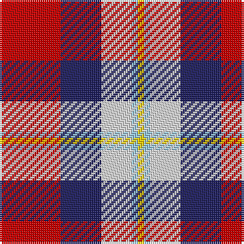

The parent of this is [Siddle, New (Corporate)](/tartans/r/30/db20/ln15/lb3/y/3/)

This was sourced from tartans-authority.  It is a [5 stripes tartan](/stripes/stripes5/).

Original link http://www.tartansauthority.com/tartan-ferret/display/10604/

## Thread count
R/30 DB20 LN15 LB3 Y/3

## Palette
Each colour and its ΔE from the base-6 reference it is a variant of.

| Colour | Shade | Base | ΔE (OKLab) |
|---|---|---|---|
| DB |  `#202060` | B  | 0.11 |
| LB |  `#98C8E8` | W  | 0.17 |
| LN |  `#E0E0E0` | W  | 0.06 |
| R |  `#C80000` | R  | 0.00 |
| Y |  `#FCCC00` | Y  | 0.04 |

# Sample pattern

ID: /variants/r/30/db20/ln15/lb3/y/3-db202060-lb98c8e8-lne0e0e0-rc80000-yfccc00/
