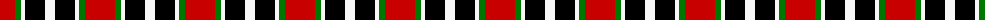
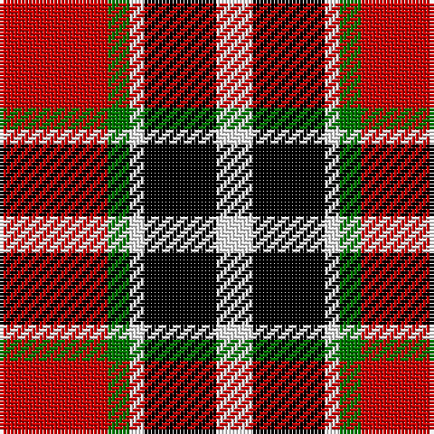

The parent of this is [SAL Cubiska Stenen](/tartans/r/30/g6/w4/k20/w/10/)

This was sourced from register-of-tartans.  It is a [5 stripes tartan](/stripes/stripes5/).

Original link https://www.tartanregister.gov.uk/tartanDetails.aspx?ref=11574

## Thread count
R/30 G6 W4 K20 W/10

## Palette
Each colour and its ΔE from the base-6 reference it is a variant of.

| Colour | Shade | Base | ΔE (OKLab) |
|---|---|---|---|
| G |  `#007800` | G  | 0.06 |
| K |  `#000000` | K  | 0.00 |
| R |  `#C80000` | R  | 0.00 |
| W |  `#F8F8F8` | W  | 0.01 |

# Sample pattern

ID: /variants/r/30/g6/w4/k20/w/10-g007800-k000000-rc80000-wf8f8f8/
