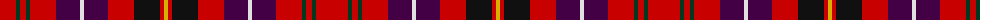

The parent of this is [Ikelman #6 (Personal)](/tartans/r/32/dg4/r6/dg4/r26/dp24/ln4/dp24/r26/k26/r4/y/4/)

This was sourced from tartans-authority.  It is a [12 stripes tartan](/stripes/stripes12/).

Original link http://www.tartansauthority.com/tartan-ferret/display/2183/

## Thread count
R/32 DG4 R6 DG4 R26 DP24 LN4 DP24 R26 K26 R4 Y/4

## Palette
Each colour and its ΔE from the base-6 reference it is a variant of.

| Colour | Shade | Base | ΔE (OKLab) |
|---|---|---|---|
| DG |  `#003820` | G  | 0.16 |
| DP |  `#440044` | B  | 0.17 |
| K |  `#101010` | K  | 0.17 |
| LN |  `#E0E0E0` | W  | 0.06 |
| R |  `#C80000` | R  | 0.00 |
| Y |  `#D8B000` | Y  | 0.05 |

ID: /variants/r/32/dg4/r6/dg4/r26/dp24/ln4/dp24/r26/k26/r4/y/4-dg003820-dp440044-k101010-lne0e0e0-rc80000-yd8b000/
