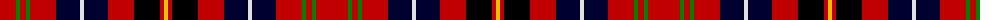

The parent of this is [Ikelman No. 6](/tartans/r/32/g4/r6/g4/r26/db24/ln4/db24/r26/k26/r4/y/4/)

This was sourced from weddslist.  It is a [12 stripes tartan](/stripes/stripes12/).

Original link http://www.weddslist.com/cgi-bin/tartans/pg.pl?source=sts

## Thread count
R/32 G4 R6 G4 R26 DB24 LN4 DB24 R26 K26 R4 Y/4

## Palette
Each colour and its ΔE from the base-6 reference it is a variant of.

| Colour | Shade | Base | ΔE (OKLab) |
|---|---|---|---|
| DB |  `#000030` | K  | 0.17 |
| G |  `#008000` | G  | 0.09 |
| K |  `#000000` | K  | 0.00 |
| LN |  `#E0E0E0` | W  | 0.06 |
| R |  `#C00000` | R  | 0.02 |
| Y |  `#F0C000` | Y  | 0.01 |

ID: /variants/r/32/g4/r6/g4/r26/db24/ln4/db24/r26/k26/r4/y/4-db000030-g008000-k000000-lne0e0e0-rc00000-yf0c000/
